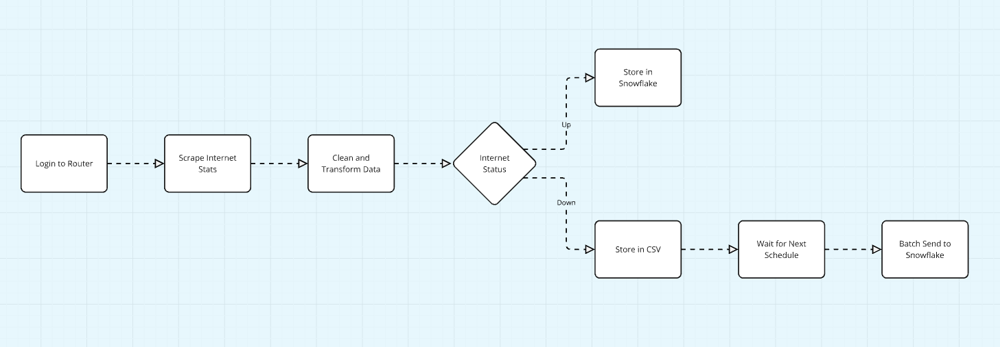

Just wrapped up a fun weekend project that combined my passion for data engineering with some hands-on tinkering! 🚀

The idea was straightforward: I wanted to monitor my internet connection throughout the day by scraping real-time stats from my router. But it quickly turned into a fully automated data pipeline to extract, transform, and load (ETL) the data into Snowflake for further analysis.

Here's a quick breakdown of the pipeline:

1. **Login to Router**: Automated login using Selenium to grab DSL statistics.
2. **Scrape Stats**: Collect details like connection status, line rates, and noise coefficients.
3. **Clean & Transform**: Convert the raw data into a structured format, complete with timestamped records.
4. **Store Data**: If the internet is up, store the data directly in Snowflake; if it's down, save it in a CSV backup until reconnected.
5. **Orchestration**: Using Dagster to manage the entire pipeline, running every 10 minutes by executing a Jupyter notebook. This setup made my code entirely independent, with Dagster handling the data flow seamlessly.

It was really cool to see how easy it was to manage this kind of orchestration using Dagster, especially with its ability to run the Jupyter notebook directly. Plus, having a CSV as a failure mechanism when the internet is down turned out to be a brilliant way to ensure no data gets lost.

If you're into data engineering and enjoy working with tools like Snowflake, Dagster, and class-structured code for pipeline management, I highly recommend experimenting with setups like these. There's nothing quite like turning a simple idea into a fully-fledged data pipeline.

What tools are you using to improve your data engineering workflows? 💡

#DataEngineering #Dagster #Snowflake #WebScraping #ETL #Automation

